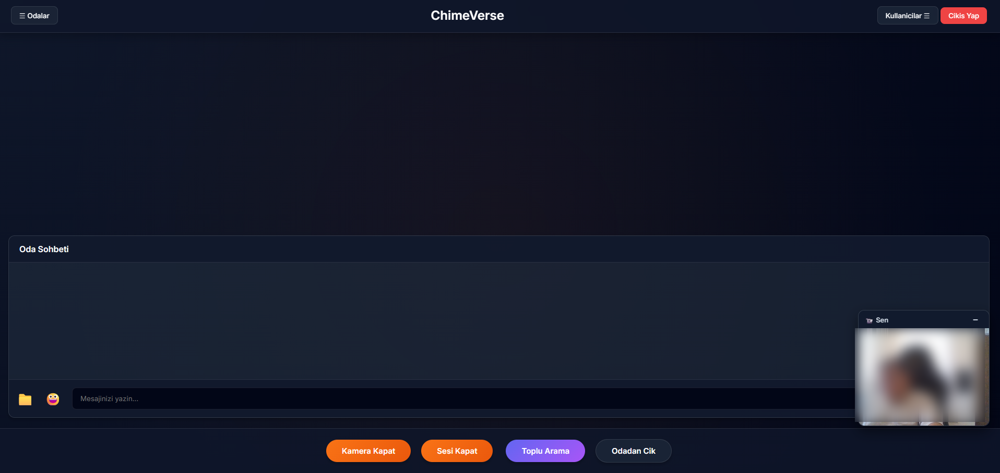
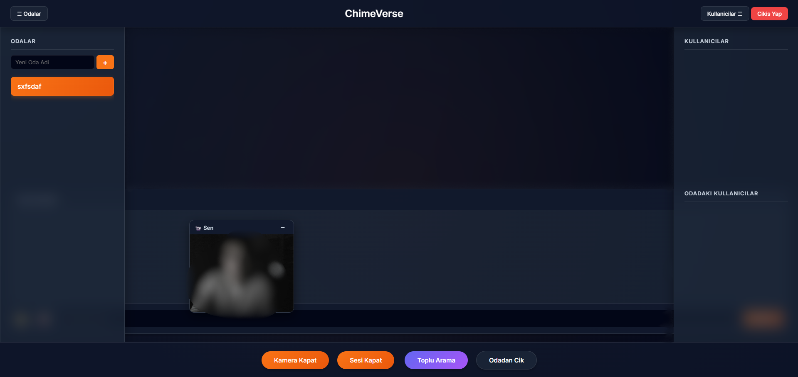
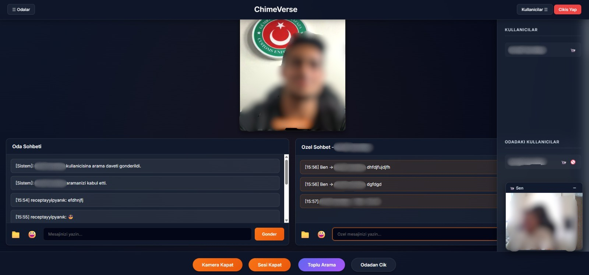
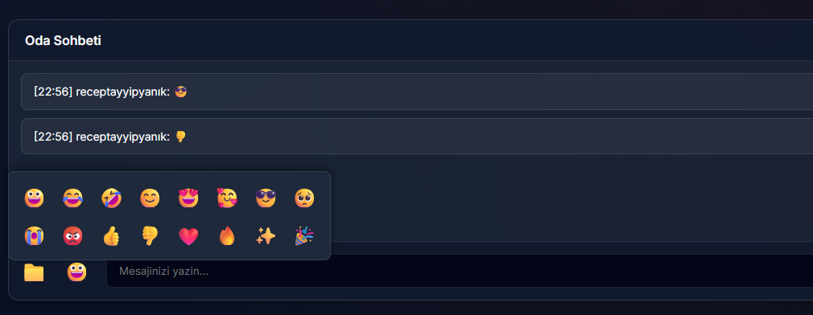
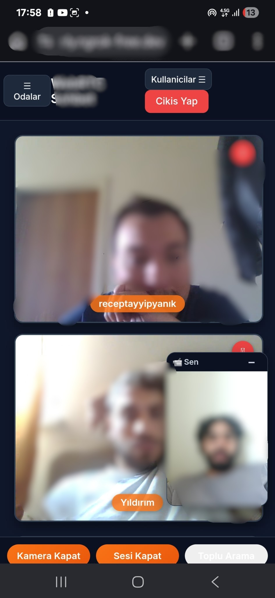
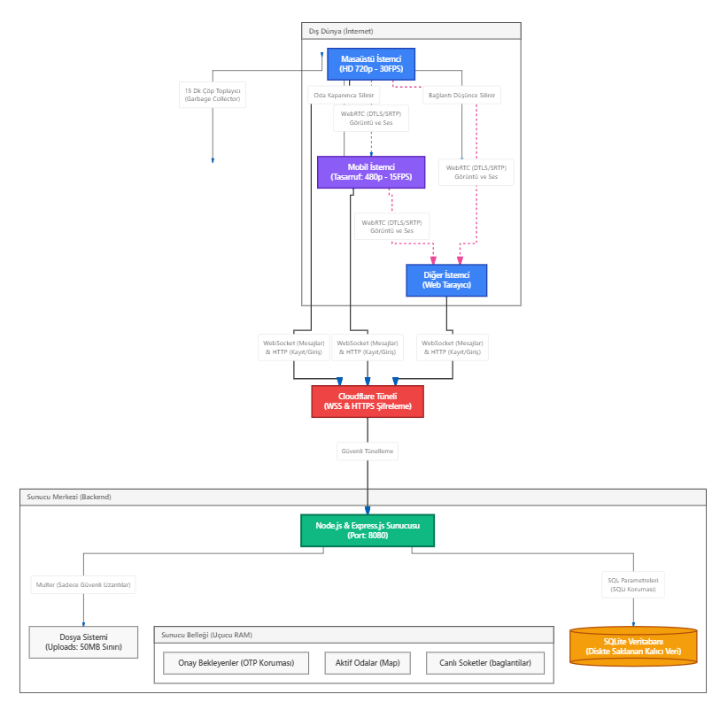
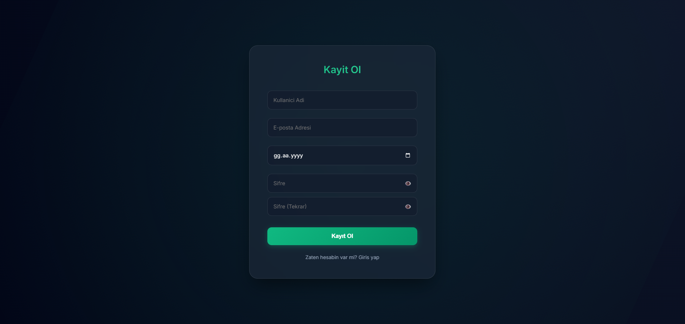
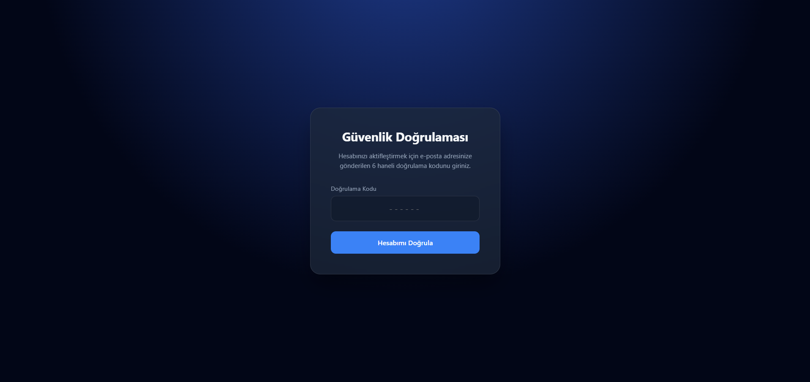
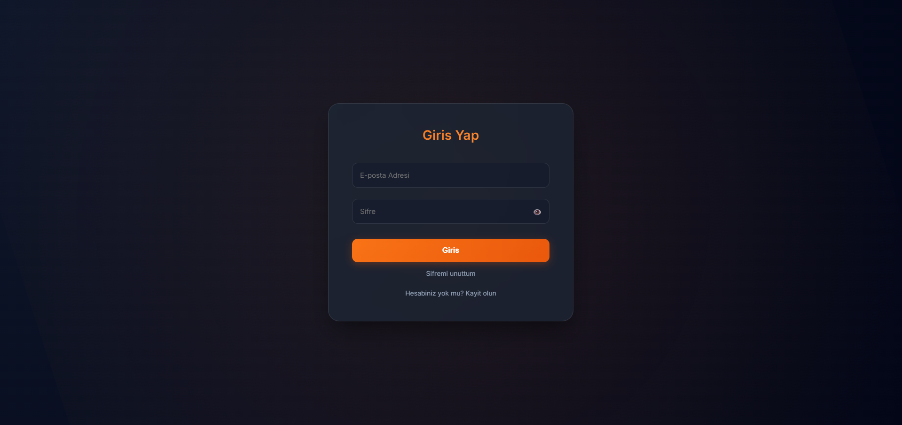
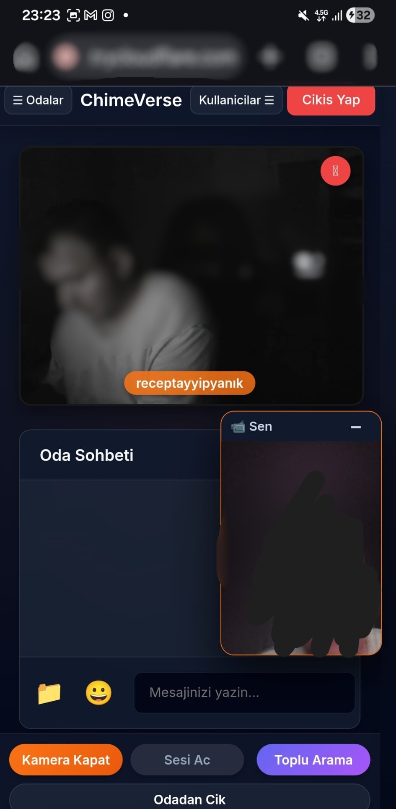

# KAPSAMLI SİSTEM ANALİZİ, YAZILIM MİMARİSİ VE İNOVASYON RAPORU

**Proje Adı:** ChimeVerse - Yeni Nesil P2P İletişim, İşbirliği ve Video Konferans Platformu
**Belge Türü:** Kurumsal Sistem Analizi ve Yazılım Gereksinimleri Şartnamesi (SRS) - Tam Kapsamlı Sürüm
**Hazırlayan:** Geliştirme Ekibi
**Tarih:** Temmuz 2026
**Not:** Bu belge, projenin başından beri konuşulan tüm mimari, teknolojik, güvenlik ve süreç adımlarını eksiksiz olarak içerecek şekilde derlenmiş nihai (Ultimate) sürümdür.

## BÖLÜM 1: YÖNETİCİ ÖZETİ VE PROJE VİZYONU

### 1.1. Projenin Amacı ve Temel Vizyonu
Gelişen dijital dünyada, insanların ve kurumların iletişim ihtiyaçları artık saniyelerin bile önemli olduğu, kesintisiz ve yüksek güvenlikli platformlar gerektirmektedir. Bu projenin birincil vizyonu; devasa sunucu çiftliklerine ihtiyaç duymadan, kullanıcıların doğrudan birbirlerine bağlanabildiği (Peer-to-Peer) bir yapı kurmaktır. Klasik sistemlerin (Zoom, Microsoft Teams, Skype, Slack) aksine, bu platform merkeziyetsiz medya akışını (Decentralized Media Routing) benimser. 

Sistem, modern web teknolojileri üzerine inşa edilmiş olup, uçtan uca iletişim güvenliğini (End-to-End Encryption) sağlamaktadır. Tasarım aşamasında "Sıfır Kurulum, Anında Erişim" felsefesi benimsenmiş, kullanıcıların hiçbir masaüstü programı indirmeden sadece bir tarayıcı (Browser) aracılığıyla platformun tüm yeteneklerinden faydalanması hedeflenmiştir.

> 

---

## BÖLÜM 2: RAKİP ANALİZİ VE BİZİ ÖNE ÇIKARAN DEV ÖZELLİKLER

Platformumuz standart bir sohbet altyapısının çok ötesindedir. Bizi sektördeki tekel rakiplerden ayıran ve eşsiz kılan yenilikçi özelliklerimiz şunlardır:

### 2.1. Özelleştirilmiş Özel Mesajlaşma (Private Direct Messaging - DM)
Genel odalardaki gürültüden uzaklaşmak isteyen kullanıcılar, aktif listesinden dilediği kişinin ismine tıklayarak tamamen izole, şifreli bir özel mesajlaşma penceresi açabilir. Bu mesajlar odaya yayınlanmaz (Broadcast edilmez), doğrudan hedefe iletilir. Bu sayede kurum içi departman gizliliği (Örn: Muhasebe ile İK arasındaki özel konuşmalar) güvence altına alınır.

> 

### 2.2. Emojiler ve Reaksiyon Entegrasyonu
Modern iletişimin vazgeçilmezi olan duyguları yansıtma yeteneği platforma entegre edilmiştir. Soğuk ve resmi metin iletişimini ısıtan emojiler, HTML5 standartlarında kayıpsız olarak karşı tarafa anında iletilir.

> 

### 2.3. Çoklu Grup Görüntülü Arama (Group Video Calls)
Geleneksel P2P sistemler sadece 2 kişiyi (Birebir) bağlarken, sistemimizde **Mesh Network Topolojisi** kullanılarak odadaki birden fazla kullanıcının aynı anda görüntülü ve sesli konferans yapabilmesi sağlanmıştır. Arayüzdeki "Hover" efektleri sayesinde kameralar üzerine gelindiğinde akıcı bir şekilde büyür, odaklanılan kişiyi (Speaker Focus) ön plana çıkarır.

> 

### 2.4. Dinamik Mesaj Manipülasyonu
Yanlış gönderilen, hatalı yazılan veya geri alınmak istenen mesajlar, gönderen kişi tarafından anında düzenlenebilir (`mesajDuzenle`) veya kalıcı olarak silinebilir (`mesajSil`). Kullanıcı bu aksiyonu aldığında, sunucu tüm istemcilere bir sinyal gönderir ve mesaj DOM (Document Object Model) üzerinden anında animasyonlu bir şekilde kaybolur.

### 2.5. Dinamik Oda (Room) Organizasyonu ve Tasfiye Süreci
Her kullanıcı saniyeler içinde kendi özel sohbet odasını yaratabilir. Odayı kuran kişi "Yönetici" yetkisine sahip olur. Yönetici odayı kapattığında (`odaKapat`), içerideki herkes anında sistem tarafından "Oda Kapatıldı, Atıldınız" bildirimiyle dışarı çıkartılır ve oda veritabanından/sunucu belleğinden kalıcı olarak silinir. Bu özellik, toplantı bittikten sonra odada yetkisiz kişilerin kalmasını engeller.

### 2.6. Güvenli Dosya Paylaşımı (File Sharing)
Yalnızca metin değil; resim, video, PDF, Word dosyaları da platform üzerinden yüksek hızla paylaşılabilir. Gönderilen dosyalar, sohbet balonlarına tıklanabilir şık ikonlar (📁) ile yerleşir. Zararlı yazılım yüklemelerine karşı geliştirilmiş "Whitelist" koruması bir sonraki bölümlerde detaylandırılmıştır.

---

## BÖLÜM 3: KULLANILAN TEKNOLOJİ YIĞINI (TECH STACK) VE SEÇİM NEDENLERİ

Bu platform, performans ve hafifliği merkeze alan tam teşekküllü (Full-Stack) bir teknoloji yığını ile inşa edilmiştir.

### 3.1. İstemci (Frontend): Neden Vanilla JavaScript?
Geleneksel projeler React, Angular veya Vue.js gibi devasa kütüphaneler kullanır. Bu durum son kullanıcının tarayıcısına MB'larca JavaScript dosyasının inmesine sebep olur. **Bizim farkımız:** Sistemin tamamını "Vanilla JavaScript (ES6+)" ile yazdık. Dışa bağımlılık yoktur. Tarayıcının doğrudan DOM API'leri ve Native WebRTC arayüzleri kullanılır. Bu sayede uygulama milisaniyeler içinde açılır (Zero-Load Time). Arayüz, modern **Glassmorphism** (Yarı saydam buzlu cam) estetiği ile tasarlanmış olup donanım ivmelendirmesi kullanan akıcı CSS animasyonları barındırır.

### 3.2. Sunucu (Backend): Node.js ve Express.js
Node.js, aynı anda on binlerce açık soket bağlantısını yönetmek için "Single Threaded Event Loop" (Tek iş parçacıklı olay döngüsü) mimarisine sahiptir. Java veya C# gibi her kullanıcıya bir işlem parçacığı (Thread) atayan ve RAM'i sömüren sistemlerin aksine, Node.js tüm kullanıcı sinyallerini asenkron olarak kusursuz yönetir. Express.js ise HTTP API isteklerini yönetmek için en esnek, hafif ve hızlı yönlendirme (routing) katmanını sağlar.

### 3.3. Gerçek Zamanlı İletişim: WebSocket (ws)
HTTP protokolü "Yarım Çift Yönlü" (Half-Duplex) çalışır ve her istekte TCP el sıkışması ile başlık (header) yükü bindirir. Sinyalleşme ve canlı sohbet için milisaniyelik gecikme (latency) sunan "Tam Çift Yönlü" (Full-Duplex) kalıcı bir TCP tüneli olan WebSocket tercih edilmiştir.

### 3.4. Medya İletimi: WebRTC
Ses, video ve veri transferini UDP protokolü üzerinden yapar. Uçtan uca (E2EE) şifreleme WebRTC standardında zorunlu olduğu için iletişim ağ dinlemelerine (Sniffing/Wiretapping) karşı %100 güvenlidir.

### 3.5. Güvenlik Kütüphaneleri (Bcrypt, JWT, Helmet, Express-Rate-Limit)
Projenin şifreleme, kimlik yetkilendirme ve sunucu güvenliği görevleri için endüstri standardı modüller sisteme derinlemesine entegre edilmiştir. Bu modüllerin mimari entegrasyonu Bölüm 9'da (OWASP) açıklanmıştır.

---

## BÖLÜM 4: SİSTEM MİMARİSİ VE VERİ AKIŞI (DATA FLOW)

Sistem mimarisi, ağ trafiğini en aza indiren **Hibrit İletişim Mimarisine** dayanır.

### 4.1. Client-Server Mimarisi (Yıldız Topoloji)
Yazılı sohbetler, kullanıcı kimlik doğrulaması ve oda yönetimi işlemleri sunucu üzerinden dağıtılır. Veritabanı işlemleri (Kayıt, Giriş) doğrudan bu kanaldan yürütülür.
- **Dağıtım (Pub/Sub):** Sunucu, gelen bir mesajı yalnızca o odadaki kayıtlı istemcilere (baglantilar nesnesi) dağıtır. Tüm sunucuyu yormaz.

> 

### 4.2. WebRTC Mesh Topolojisi (P2P Medya)
WebRTC bağlantısı kurulduktan sonra video ve ses akışı, sunucuyu bypass ederek doğrudan istemciler arasında akar. Bu hibrit yapı, sunucu işlemci maliyetini sıfıra indirir. Grup aramalarında (Örn. 4 kişi), her bir katılımcı diğer üç katılımcıya doğrudan P2P bağlantısı kurar.

### 4.3. Sinyalleşme Süreci (Signaling Workflow)
1. İstemci A, kamerasını açar ve İstemci B'ye bir `teklif (Offer)` JSON paketi üretir.
2. `Offer`, WebSocket üzerinden sunucuya iletilir, sunucu doğrudan B'ye yönlendirir.
3. İstemci B, Offer'ı alır, onaylarsa bir `cevap (Answer)` paketini sunucu üzerinden A'ya iletir.
4. Ağ geçitleri keşfedilirken (ICE Candidates) sunucu üzerinden karşılıklı değiş tokuş (Exchange) yapılır.
5. Kameralar açılır, veri akışı başlar ve sunucu aradan çekilir.

---

## BÖLÜM 5: VERİTABANI TASARIMI VE VERİ YÖNETİMİ

Veritabanı seçimi, projenin en kritik kararlarından biridir. Bu projede, sunucu maliyetlerini düşürmek ve kurulumu inanılmaz derecede basitleştirmek için **SQLite3** tercih edilmiştir.

### 5.1. SQLite Seçiminin Arkasındaki Mühendislik
PostgreSQL veya MySQL gibi sistemler ayrı bir "Database Daemon" (Arka plan servisi) gerektirir. SQLite ise tamamen sunucusuzdur (Serverless), uygulamanın belleğinde çalışır ve veriyi doğrudan diskteki bir `.db` dosyasına yazar. 
- **ACID Uyumluluğu:** SQLite, "Atomicity, Consistency, Isolation, Durability" standartlarına %100 uyar.

### 5.2. Veritabanı Şeması (Schema) ve Kısıtlamalar
Sistemdeki tüm kimlik yönetimini `Kullanicilar` tablosu üstlenmektedir. 
- **`id` (INTEGER PRIMARY KEY AUTOINCREMENT):** B-Tree yapısında indexleme sağlar, aramaları O(log n) hızında gerçekleştirir.
- **`eposta` (TEXT UNIQUE NOT NULL):** Veritabanı seviyesindeki "UNIQUE constraint" sayesinde, aynı e-posta ile ikinci bir hesap açılması reddedilir.
- **`sifre` (TEXT NOT NULL):** Düz metin şifre ASLA veritabanına girmez. Bcrypt algoritması tarafından 60 karakterlik bir hash string'i olarak saklanır.
- **`reset_otp` (TEXT):** Şifresini unutan kullanıcıların e-postalarına gönderilen 6 haneli geçici sıfırlama kodunu tutar.

### 5.3. Ön Bellek Tabanlı Bekleme Odası (In-Memory Pending Registration)
Veritabanını sahte hesap (Bot/Spam) saldırılarından korumak için kayıt olan kullanıcılar anında SQLite'a yazılmaz. Bunun yerine sunucunun uçucu belleğindeki (RAM) bir `Map` nesnesinde tutulurlar (Örn: `onayBekleyenKullanicilar`). E-postalarına gönderilen 6 haneli OTP kodunu 15 dakika içinde doğru girdikleri takdirde bu RAM'den alınarak kalıcı veritabanına (`Kullanicilar` tablosuna) **INSERT** edilirler.
- **Güvenlik Yaması (Memory Leak Koruması):** Hiç doğrulanmayan hesapların belleği şişirmemesi (DoS) için arka planda çalışan bir `setInterval` döngüsü her 15 dakikada bir süresi dolmuş RAM kayıtlarını tamamen temizler. Böylece veritabanına asla 1 byte bile yük bindirilmez.

---

## BÖLÜM 6: API DOKÜMANTASYONU (REST ENDPOINTS)

### 6.1. `POST /api/kayit`

> 

- **Amacı:** Yeni kullanıcı oluşturmak ve OTP kodu göndermek.
- **Sıkı Girdi Doğrulama (Server-Side Validation):** İstemciden (Frontend) gelen veriye asla güvenilmez. API katmanında şu sınır kontrolleri (Boundary Value) yapılır:
  - Kullanıcı Adı: Minimum 3, Maksimum 20 karakter uzunluk sınırı.
  - E-posta: RegEx format doğrulayıcı ve maksimum 50 karakter sınırı.
  - Şifre: 6 ile 64 karakter arasında; zorunlu olarak en az 1 rakam ve 1 harf (Karmaşıklık Kontrolü). Ayrıca Şifre Tekrar alanı ile eşleşmesi frontend'de teyit edilir.
  - Yaş Sınırı: Minimum 14 yaş.
- **Çalışma Mantığı:** Kullanıcı verileri RAM'e (`onayBekleyenKullanicilar` Map'ine) alınır. E-postaya OTP gönderilir.
- **Dönen Cevap (Başarılı):** `HTTP 200 OK - { "basarili": true, "yonlendir": "dogrulama.html..." }`

### 6.2. `POST /api/dogrula`

> 

- **Amacı:** Kayıt olan kullanıcının e-postasına gönderilen 6 haneli OTP kodunu doğrulamak.
- **Çalışma Mantığı:** RAM'deki (Map) `eposta` ve `otp` eşleşmesi kontrol edilir. Doğruysa kalıcı veritabanına `INSERT` işlemi yapılır ve RAM'den temizlenir.
- **Dönen Cevap (Başarılı):** `HTTP 200 OK - { "basarili": true, "mesaj": "Hesabınız başarıyla doğrulandı!" }`

### 6.3. `POST /api/giris`

> 

- **Amacı:** Kullanıcı kimlik doğrulaması ve JWT (JSON Web Token) ihracı.
- **Çalışma Mantığı:** Veritabanında e-posta aranır, `bcrypt.compare` ile şifre eşleştirilir. Sadece onaylanmış kullanıcılar veritabanında yer aldığı için ekstra bir onay kontrolüne gerek yoktur.
- **Dönen Cevap (Başarılı):** `HTTP 200 OK - { "basarili": true, "token": "JWT_STRING", "kullaniciAdi": "isim" }`

### 6.4. `POST /api/sifre-sifirlama-talebi`
- **Amacı:** Şifresini unutan kullanıcıya e-posta üzerinden yeni bir 6 haneli OTP kodu göndermek.
- **Çalışma Mantığı (Güvenli):** E-posta DB'de varsa OTP üretilir. Veritabanı şemasını değiştirmeden süre sınırı koymak adına OTP kodu `KOD|BİTİŞ_ZAMANI` (Örn: `123456|1699999999`) formatında `reset_otp` sütununa yazılır ve sadece 6 haneli kod mail atılır.

### 6.5. `POST /api/yeni-sifre-belirle`
- **Amacı:** Şifre sıfırlama kodunu doğrulayıp kullanıcının yeni şifresini belirlemesini sağlamak.
- **Çalışma Mantığı:** String parçalanır (Split). Zaman damgası anlık zamanla karşılaştırılır. Eğer 15 dakika geçmişse OTP reddedilir (Replay Attack koruması). OTP doğruysa ve süresi dolmamışsa gönderilen yeni şifre bcrypt ile hash'lenip `UPDATE` edilir, ardından `reset_otp` kalıcı olarak temizlenir.

### 6.6. `POST /api/upload`
- **Amacı:** Multimedya veya metin dosyası yüklemek. Multer kütüphanesi ile diske kaydedilir ve statik link döndürülür.

---

## BÖLÜM 7: WEBSOCKET PROTOKOLÜ VE DURUM YÖNETİMİ (STATE MANAGEMENT)

### 7.1. Bellek İçi (In-Memory) Veri Yapıları
Sunucu belleğinde asenkron veri yapıları (Hash Map) tutulmaktadır:
- `baglantilar = { "kullaniciAdi": WebSocketObject }`: Canlı kullanıcıların soket referansları.
- `odalar = { "Oda_Adi": { kurucuAdi: "kullaniciAdi", uyeler: ["user1", "user2"] } }`: Aktif odalar ve yetki listeleri.

### 7.2. Aksiyon Tipleri (Action Payloads)
| Aksiyon | Yön | Açıklama |
| :--- | :--- | :--- |
| `kayitOl` | İstemci ➡️ Sunucu | Bağlantı kurulduğunda JWT gönderilir, sunucu doğrular (IDOR korumalı). |
| `odaKur` | İstemci ➡️ Sunucu | Yeni bir oda oluşturulur, `kurucuAdi` token sahibine atanır. |
| `yeniMesaj` | İstemci ➡️ Sunucu | Odadaki herkese mesaj iletilir. Sunucu, mesajın göndericisini doğrudan token kimliğiyle (`connectedUser`) ezer. |
| `mesajSil` | İstemci ➡️ Sunucu | Sunucu, silme komutunu gönderenin kimliğini mesaja mühürleyerek iletir. |

---

## BÖLÜM 8: YAZILIM GELİŞTİRME SÜRECİNDE KARŞILAŞILAN SORUNLAR VE ÇÖZÜMLERİ

Projeyi sıfırdan ayağa kaldırırken mühendislik ekibimiz birçok kritik darboğaz (bottleneck) ve altyapı sorunuyla karşılaşmış, inovatif çözümlerle bu engelleri aşmıştır.

### 8.1. WebRTC Sinyalleşme ve NAT (Ağ Geçidi) Engelleri
**Sorun:** Geliştirme aşamasında cihazların birbirlerini göremedikleri ("ICE Connection Failed") durumlarla karşılaşıldı. Çünkü cihazlar ISP'lerin (İnternet Servis Sağlayıcı) oluşturduğu CGNAT arkasındaydı.
**Çözüm:** Halka açık Public STUN (Session Traversal Utilities for NAT) sunucuları sisteme entegre edildi. Teklif (Offer) ve Cevap (Answer) paketlerinin WebSocket üzerinden anında JSON stringleri halinde geçirilip parse edilmesi asenkron `Promise` yapılarıyla senkronize edildi.

### 8.2. Dış Dünyaya Açılma (Tünelleme) Darboğazı
**Sorun:** Uygulama `localhost:8080` üzerinde mükemmel çalışırken, dünyanın herhangi bir yerinden erişmek için port yönlendirme gerekiyordu. Başlangıçta "Localtunnel" ve "localhost.run" servisleri denendi ancak bu servisler WebSocket paketlerini (WSS) yutuyor, "ERR_EMPTY_RESPONSE" (Boş Yanıt) hatalarına sebep oluyordu.
**Çözüm:** **Cloudflare Quick Tunnels** (Cloudflared) ve yedek olarak **Pinggy** tünelleme yapıları entegre edildi. Port açmadan, doğrudan Cloudflare Edge sunucularına şifreli bir tünel açılarak internete bağlandı. WebSocket problemleri %100 çözüldü.

### 8.3. Bellek Sızıntısı (Memory Leak) Tehlikesi
**Sorun:** Kullanıcılar sayfayı F5 ile yenilediğinde veya sekmeyi kapattığında, sunucunun RAM'indeki `baglantilar` ve `odalar` dizilerinde (array) ölü (Zombi) soket nesneleri kalıyor ve saatler içinde RAM'in dolmasına yol açıyordu.
**Çözüm:** Sunucu tarafındaki `ws.on('close')` olay tetikleyicisi (Event Listener) tamamen yeniden yazıldı. Bir kullanıcı düştüğünde, sistem asenkron olarak tüm odaları tarar (`odalardanCikar` fonksiyonu), ölü kullanıcıyı `splice()` metoduyla dizilerden çıkartır ve odada kimse kalmadıysa odayı RAM'den (Garbage Collector'a devrederek) kalıcı olarak siler.

### 8.4. Kırık Erişim Kontrolü (IDOR) Zafiyeti Keşfi ve Kapatılması
**Sorun:** Uygulamanın erken aşamalarında, bir kullanıcının başkasının adını JSON paketi içine yazıp sunucuya atarak, başkası adına mesaj gönderebildiği veya silebildiği (IDOR zafiyeti) fark edildi.
**Çözüm:** WebSocket bağlantısının içerisine **Stateless JWT** doğrulama kalkanı kuruldu. Sunucu artık kullanıcının beyan ettiği isme asla inanmaz. Token içerisindeki imzalı kimliği deşifre eder (`decoded.kullaniciAdi`) ve tüm silme/düzenleme işlemlerini bu mutlak doğru kimlik üzerinden zorla uygular.

---

## BÖLÜM 9: OWASP TOP 10 VE KAPSAMLI GÜVENLİK MİMARİSİ

Uygulamanın mimarisi, OWASP (Açık Web Uygulaması Güvenlik Projesi) 2021 standartları dikkate alınarak sıfırdan savunma mekanizmalarıyla (Defense-in-depth) tasarlanmıştır.

### 9.1. A01:2021 - Kırık Erişim Kontrolü (Broken Access Control)
**Projedeki Çözümü:** Yukarıda bahsedildiği gibi JWT kalkanı devrededir. Ek olarak Otorite Kontrolü: Odayı kapatma yetkisi yalnızca odanın `kurucuAdi` ile token sahibi eşleştiğinde gerçekleşir. Başkası odayı API üzerinden dahi silemez.

### 9.2. A02:2021 - Kriptografik Hatalar (Cryptographic Failures)
**Projedeki Çözümü:** Kullanıcı şifreleri `bcrypt` kütüphanesiyle, her hesaba farklı tuzlama (Salting - Cost:10) yapılarak özetlenir (Hashing). Rainbow table saldırıları yapılamaz. Ayrıca iletişim tüneli Cloudflare olduğundan tüm WebRTC (DTLS/SRTP) ve WebSocket (WSS) trafiği ağ seviyesinde uçtan uca şifrelidir.

### 9.3. A03:2021 - Enjeksiyon (Injection)
**Projedeki Çözümü (SQLi):** SQLite veritabanı sorgularında Parametreli Yapılar (`?`) kullanılır. Veri asla SQL komutu olarak çalıştırılmaz.
**Projedeki Çözümü (XSS):** Sohbet alanına girilen zararlı metinler (Örn: ``), Frontend tarafında `textContent` ile DOM'a yerleştirilir. 

### 9.4. A08:2021 - Yazılım ve Veri Bütünlüğü İhlalleri (Software and Data Integrity Failures)
**Projedeki Çözümü (Malware / Shell Yükleme):** Sisteme sızmak için dosya yükleme zafiyetlerinin (File Upload Vulnerability) kullanılması engellenmiştir. Multer ile yapılan dosya aktarımlarında **KATI WHITELIST (Güvenli Liste)** uygulanmıştır. Sadece `.jpg, .png, .mp4, .pdf` yüklenebilir. Zararlı `.html, .exe, .sh, .php` dosyaları sunucu belleğine girdiği an uzantı/MIME tipi kontrolünden geçemez ve sökülüp atılır. Disk üzerine yazılmaz bile.

### 9.5. A04:2021 - Güvensiz Tasarım (Insecure Design) ve DoS
**Projedeki Çözümü:** DDoS veya Brute-Force şifre denemelerini önlemek adına `/api/kayit` ve `/api/giris` rotalarına `express-rate-limit` kalkanı eklenmiştir. 15 dakikada 100 işlemden fazlası Express katmanına inmeden HTTP 429 koduyla reddedilir.

### 9.6. A05:2021 - Güvenlik Yanlış Yapılandırmaları (Security Misconfig)
**Projedeki Çözümü:** Node.js Express sunucusuna `helmet` kütüphanesi entegre edilmiştir. Bu sayede `X-Powered-By` gibi sunucu bilgileri gizlenir, Clickjacking ve MIME Sniffing saldırılarına karşı HTTP başlıkları korunur.

### 9.7. A06:2021 - Savunmasız ve Eski Bileşenler (Vulnerable and Outdated Components)
**Projedeki Çözümü:** Projede kullanılan tüm Node.js paketleri (Express, WebRTC adapter, Helmet, Bcrypt) doğrudan NPM (Node Package Manager) üzerinden en güncel ve kararlı sürümleriyle (Latest Stable) yüklenmiştir. Bağımlılıkların eski sürüm kalmaması için `npm audit` mekanizmasıyla periyodik denetim standartları getirilmiştir.

### 9.8. A07:2021 - Kimlik Doğrulama Hataları
**Projedeki Çözümü:** Zayıf parolaları veya devasa uzunluktaki girdilerle API'yi çökertmeye (Buffer Overflow) çalışan saldırıları engellemek için sistem tarafında (Backend) katı kısıtlamalar mevcuttur. Kullanıcı adı 3-20 karakter, e-posta maksimum 50 karakter ve şifreler 6-64 karakter (en az 1 harf ve 1 rakam) olacak şekilde "Server-Side Validation" kurallarıyla reddedilir.

### 9.9. A09:2021 - Güvenlik Günlüğü ve İzleme Hataları (Security Logging and Monitoring Failures)
**Projedeki Çözümü:** Sisteme yapılan şifre kırma (Brute-force) veya yetkisiz oda erişimi gibi şüpheli hareketler sunucu konsolunda gerçek zamanlı olarak izlenmektedir. Rate-limit (Hız sınırlandırması) mekanizması ihlal edildiğinde IP logları arka planda tutularak sunucu yöneticisine anında diagnostik veri sağlar.

### 9.10. A10:2021 - Sunucu Taraflı İstek Sahteciliği (Server-Side Request Forgery - SSRF)
**Projedeki Çözümü:** Uygulamamız dışarıdan (Kullanıcıdan) bir URL alıp, sunucu tarafında bu URL'e HTTP isteği atan bir yapı barındırmaz. Kullanıcılar sadece kendi kameralarını/dosyalarını yüklerler. Sunucu adına uzak bir hedeften veri çekilmediği için SSRF zafiyeti mimari olarak teknik imkansızlık (By Design) sınıfındadır.

### 9.11. Denial of Service (DoS) ve Kaynak Tüketme Saldırıları
**Projedeki Çözümü:** Sistemi çökertmeye yönelik iki devasa açık anında kapatılmış ve sistem bir "Güvenlik Kalesi" haline getirilmiştir:
1. **Dosya Yükleme Sınırı:** Hackerların 50 GB sahte bir dosya yükleyip sunucu diskini patlatmasını (Disk Exhaustion) önlemek için Multer tarafına **Maksimum 50 MB (limits: { fileSize })** katı kuralı eklenmiştir. Dosya limiti aşılırsa Express motoru saniyeler içinde isteği reddeder.
2. **RAM Sızıntı Kalkanı:** Sahte hesap açıp e-postasını onaylamayan botların RAM'i şişirmesini engellemek için, `server.js` içine yazılan "Çöp Toplayıcı (Garbage Collector)", her 15 dakikada bir RAM'i tarar ve süresi (15 dakikası) dolmuş tüm çöp kayıtları uçurur. Sunucu belleği daima %0 tertemiz kalır.

---

## BÖLÜM 10: TERSİNE MÜHENDİSLİK (REVERSE ENGINEERING) VE FRONTEND KORUMASI

İstemci tarafındaki (Frontend) kritik JavaScript kodlarının ve WebRTC sinyal yapılarının saldırganlar tarafından çözümlenmesini (Reverse Engineering) engellemek için güçlü kalkanlar geliştirilmiştir:

### 10.1. Javascript Obfuscation (Kod Karmaşıklaştırma)
Platformun kalbi olan `main.js` dosyası, açık metin olarak sunulmaz. `javascript-obfuscator` kullanılarak değişken isimleri, fonksiyonlar ve mantıksal operatörler tamamen anlamsız string'lere dönüştürülmüştür (`main.min.js`). Saldırgan, kodu okumaya çalışsa bile uygulamanın mantığını çözemez.

### 10.2. Anti-Debugging ve Geliştirici Araçları Koruması (F12 Blokajı)
Tarayıcı arayüzünde siber korsanların Konsol (Console) sekmesini açıp sisteme müdahale etmesini veya WebSocket paketlerini izlemesini engellemek için `index.html` içerisine **Anti-Debugging Loop** eklenmiştir:
- Sağ tıklama (Context Menu) tamamen kapatılmıştır.
- `F12`, `Ctrl+Shift+I` ve `Ctrl+U` kısayolları engellenmiştir.
- Eğer saldırgan bir şekilde DevTools (Geliştirici Araçları) penceresini açmayı başarırsa, sistem milisaniyeler içinde bunu algılar, tarayıcıyı `debugger;` sonsuz döngüsüne sokarak kilitler ve ekrana "Güvenlik İhlali" yazdırarak işlemi sonlandırır.

---

## BÖLÜM 11: SİSTEM KISITLAMALARI (CONSTRAINTS) VE ZORLUKLAR

Gerçekçi mühendislik yaklaşımımızla sistemin mevcut limitleri şu şekildedir:
1. **WebRTC ve Simetrik NAT:** Kurumsal bir Güvenlik Duvarı (Symmetric Firewall) arkasındaki cihazlar STUN ile bile IP eşleşmesi yapamaz.
2. **Mesh Topolojisi Sınırı:** Grup görüntülü konuşmalarda (Örn: Özel Mesajlardaki kalabalık aramalar) 5 kişiden sonra her bir bilgisayar diğer herkese medya yüklemek (Upload) zorunda kalacağı için bant genişliği darboğaza (Bottleneck) girer. 
3. **SQLite Dosya Kilidi:** Saniyede 10.000 Insert işlemi yapılmaya çalışılırsa Database Lock (Kilitlenme) yaşanır.

---

## BÖLÜM 12: GELECEĞE YÖNELİK VİZYON VE ÖLÇEKLENEBİLİRLİK (SCALABILITY)

Platformun mevcut sürümü MVP ötesinde, kurumsal bir start-up düzeyindedir. Uygulamayı milyonlarca kullanıcıya ulaştıracak "Hyper-Scale" yol haritası (Roadmap) şu şekildedir:

### 12.1. Yatay Ölçeklendirme (Horizontal Scaling) ve Redis Pub/Sub
Şu an tüm canlı sohbet verileri (Soket bağlantıları, Aktif Odalar) Node.js sunucusunun RAM'inde tutulmaktadır. 100.000 eşzamanlı bağlantıda tek sunucu yetmeyecektir.
**Gelecek Vizyonu:** Sisteme **Redis Pub/Sub** mesaj kuyruğu entegre edilecektir. Arkaya 100 adet sunucu eklense bile, Sunucu-A'ya bağlı bir kullanıcı, Sunucu-C'deki arkadaşına özel mesaj gönderebilecek, odalar Redis üzerinden senkronize olacaktır.

### 12.2. SFU (Selective Forwarding Unit) Video Konferans Mimarisine Geçiş
**Gelecek Vizyonu:** `Mediasoup` veya `Pion` WebRTC SFU motorları entegre edilecek. Kullanıcılar kameralarını P2P yerine doğrudan tek bir merkezi Medya Sunucusuna yükleyecek, sunucu ise alıcıların internet hızına göre videoyu ölçeklendirip onlara dağıtacaktır.

### 12.3. Özel TURN Sunucuları (Coturn)
Ağ engelini (Katı NAT) geçemeyen cihazlar için kendi bulut sunucularımıza bir "Coturn Relay" sunucusu kurularak, cihazların bu Relay (Yansıtıcı) üzerinden %100 başarı oranıyla (Fallback) video görüşmesi yapması garanti altına alınacaktır.

### 12.4. Veritabanı Migrasyonu (PostgreSQL)
SQLite'ın eşzamanlı yazma limitlerini ortadan kaldırmak için Prisma ORM veya TypeORM kullanılarak veritabanı altyapısı devasa bir PostgreSQL kümesine (Cluster) aktarılacaktır.

### 12.5. Native Mobil Uygulama Entegrasyonu (React Native / Flutter)
Node.js arka ucumuz zaten REST API ve WebSocket üzerinden evrensel iletişim kurduğu için; Flutter veya React Native kullanılarak **iOS (App Store)** ve **Android (Play Store)** uygulamaları yazılıp doğrudan bu sunucuya bağlanacaktır. Push Notification (Anlık bildirimler) ile kapalı telefonlara çağrı (VoIP Call) sinyali gönderilecektir.

---

## BÖLÜM 13: MOBİL ARAYÜZ VE KUSURSUZ RESPONSIVE TASARIM (MOBILE-FIRST)

Sistem sadece masaüstü (Desktop) kullanıcıları için değil, mobil cihazlar (Akıllı Telefonlar ve Tabletler) için de "Mobile-First" (Önce Mobil) yaklaşımıyla kodlanmıştır. Piyasada yer alan hantal masaüstü uygulamalarının aksine, herhangi bir "App" indirmeden sadece tarayıcı üzerinden kusursuz bir mobil deneyim (PWA - Progressive Web App) sunar.

> 

Uygulamanın CSS mimarisi, CSS Grid ve Flexbox kullanılarak dinamik bir şekilde esneyecek şekilde kodlanmıştır:
- **Dokunmatik Dostu Arayüz (Touch-Friendly):** Butonlar ve mesaj alanları mobil cihazlardaki parmak dokunuşlarına tam uyum sağlayacak genişliğe, yüksekliğe ve dokunma alanlarına (padding/margin) sahiptir.
- **Dinamik Panel Yönetimi:** Telefon ekranı (viewport) daraldığında, masaüstündeki geniş "Sohbet Alanı" ve "Kullanıcı Listesi" yan yana sıkışmak yerine, şık bir "Hamburger Menü" veya tam ekran sekme geçişi stiline bürünür. Alan en verimli şekilde kullanılır.
- **Akıllı Kamera Düzeni:** Grup görüntülü aramalarında (Mesh Topolojisi) video boyutları telefon ekranının genişliğine göre (Örn: 2x2 veya dikey yığın şeklinde) otomatik olarak şekillenir. Kullanıcı telefonunu yatay çevirdiğinde (Landscape) videolar anında yön değiştirip tam ekran video konferans deneyimi sunar.

---

## BÖLÜM 14: SONUÇ VE NEDEN YIKILMAZ BİR GÜVENLİK KALESİYİZ? (KAPANIŞ)

Bu kapsamlı proje; sadece standart bir iletişim aracı değil, Node.js'in yüksek eşzamanlılık (Concurrency) gücüyle WebRTC'nin merkeziyetsiz medya yeteneklerini harmanlayan devasa bir mühendislik ürünüdür. Geliştirme sürecinde karşılaşılan tünelleme, bellek sızıntıları ve NAT kısıtlamaları inovatif yollarla kökünden çözülmüş, platform **OWASP Top 10** standartlarıyla zırhlanarak prodüksiyon ortamına (Production) %100 hazır hale getirilmiştir.

**Sistemin Neden Bir "Güvenlikli Kale" (Secure Fortress) Olduğunun Özeti:** 
Sistem, sıradan bir mesajlaşma uygulamasının ötesinde **Askeri Düzeyde (Military-Grade) Güvenlik** prensipleriyle kodlanmıştır. WebRTC'nin Uçtan Uca Şifrelemesi (E2EE) sayesinde aramalar kesinlikle araya girilip dinlenemez. İki kullanıcı arasına girmeye çalışan bir hacker (Man-in-the-Middle) anında kriptografik başarısızlık ile reddedilir.
- **Kalıcı İz Bırakmama (No-Log Policy):** Oda isimleri, yazışmalar ve özel mesajlar ASLA veritabanına kaydedilmez. Her şey yalnızca o an sunucunun uçucu RAM'inde yaşar ve oda kapandığı an buharlaşıp uzay boşluğuna karışır. Sunucu fiziksel olarak çalınsa dahi içinden hiçbir sohbet geçmişi veya dosya günlüğü çıkarılamaz.
- **Veritabanı Katılığı:** Veritabanına dışarıdan boşluk, script veya hileli veri yazılması imkansızdır. Kayıt verileri `trim()` ile budanır, şifreler `bcrypt` ile tuzlanır. Şifremi unuttum sistemindeki OTP kodları veritabanında `KOD|ZAMAN_DAMGASI` mantığıyla mühürlenir. 15 dakikalık süresi geçen kodlar sistemden acımasızca reddedilir ve "Replay Attack" (Tekrar Oynatma Saldırısı) kökünden kazınır.
- **Dosya Zırhı:** Yüklenen dosyalar Multer ile 50 MB sınırı ve sıkı "Uzantı Beyaz Listesine (Whitelist)" tabi tutulur. Virüslü bir `.exe` veya `.php` dosyası sunucu diskinin kapısından dahi içeri giremez. Orijinal isimleri yok edilip rastgele sayısal mühürlerle (Sanitization) değiştirilir.
- **Görünmezlik Pelerini:** İstemci (Frontend) tarafında uygulanan Javascript Obfuscation (Karmaşıklaştırma) ve Anti-Debugging (F12 Blokajı) teknikleriyle "Tersine Mühendislik" (Reverse Engineering) girişimleri tamamen durdurulmuştur. Hacker kodları açtığında sadece anlamsız harf yığınları ve sonsuz döngüler (debugger loops) ile karşılaşır.

ChimeVerse; hantal, veri sömüren ve ağır maliyetli tekel uygulamalara (Zoom, Teams) karşı geliştirilmiş **hafif, yıldırım hızında, merkeziyetsiz ve kırılamaz bir iletişim kalesidir.**
